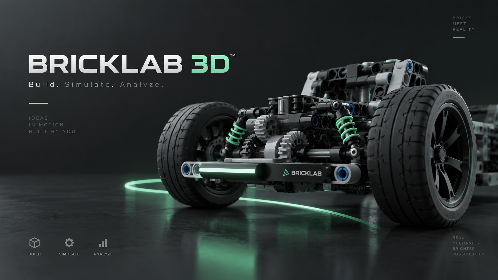

# BrickLab 3D

**BrickLab 3D** is a browser-based mechanical construction sandbox for building brick/Technic-style vehicles, drivetrains and mechanisms, then testing how they actually behave.

Core loop: **build → simulate → test → inspect telemetry → modify → test again**.

[**Open BrickLab 3D**](https://deenfoool.github.io/BrickLab-3D/)



## Current state

### Builder

- Three.js scene with improved lighting, shadows and procedural part geometry.
- 37 prototype parts including an expanded basic construction pack: multiple brick/plate sizes, Technic beams 3L/5L/7L/9L/11L, Technic bricks, Axle 2L/3L/5L/7L/9L, bushes, pins, gears, wheel, Lab Motor, F/N/R Gearbox, Open Differential, Bearing Block, Suspension Arm and sensors.
- Catalog-wide Visual v3 pass: refined ABS/metal/rubber materials, Technic hole liners, axle detail bands, gear-face detail, power-unit fasteners, wheel sidewall detail and improved shadows.
- Decorative Visual v3 meshes are excluded from Physics v2 collider bounds, so visual detail does not change simulation geometry.
- Connector types: `stud`, `tube`, `pin`, `pin-hole`, `axle`, `axle-hole`.
- Connector snapping, grid snapping, persistent connection graph, bearings and keyed shafts.
- Undo/redo, autosave, `.bricklab` v2 import/export, multi-select and logical grouping.
- Floating Parts / Properties windows with drag, resize, List/Grid, collapsible inspector sections, Focus Scene and mobile drawers.
- RU / EN interface switch.
- Higher-resolution real 3D part previews in the catalog with contact shadow presentation.

Scale is intentionally unavailable: arbitrary scaling would break mechanical dimensions and connector pitch.

## Physics v2

Rapier 3D runs a separate SI-scale physical world while the editor remains stud-based:

```text
1 stud = 0.008 m
mass    = kg
force   = N
torque  = N·m
speed   = m/s
power   = W
```

Physics v2 includes:

- per-part prototype masses and material/collision classes;
- inertia derived from collider mass/shape;
- weighted center of mass and approximate front/rear + left/right weight distribution;
- fixed physics timestep independent of render FPS;
- FAST 60 Hz / BALANCED 120 Hz / ACCURATE 180 Hz presets;
- CCD on Balanced/Accurate;
- self-collision OFF / MECHANICAL / FULL;
- corrected transformed colliders for rotated wheels/gears;
- physical hinge/bearing joints;
- finite motor torque and reaction torque;
- bounded gear/gearbox/differential torque transfer;
- wheel contact, normal load, slip ratio and slip angle;
- load-sensitive longitudinal/lateral grip;
- rolling resistance and approximate weight transfer;
- surface presets: concrete, asphalt, dirt, gravel, mud and ice;
- suspension compression/rebound damping, bump stop and simple anti-roll coupling.

The **Physics** menu exposes quality, self collision, debug, surface override and Mass/COM overlay. `F8` toggles Physics Debug.

See [`docs/PHYSICS_V2.md`](docs/PHYSICS_V2.md).

## Motor and drivetrain

Prototype Lab Motor:

```text
no-load speed: 120 RPM
stall torque:  0.045 N·m
voltage:       9 V
```

Telemetry includes actual RPM, load, torque, current, mechanical/electrical power, efficiency and stall state.

`drivetrain.js` derives semantic shafts and relationships from the construction. It supports:

- automatic spur gear mesh detection;
- multi-stage RPM/torque propagation;
- F/N/R gearbox;
- open differential with independent left/right RPM;
- drivetrain conflict detection;
- requested/transmitted torque and loss accounting.

Gear pitch stays aligned to the editor grid:

```text
pitch radius = teeth / 16 stud
```

## TEST Lab

Physics v2 TEST uses a deterministic protocol:

```text
RESET → SETTLE 0.5 s → 3 → 2 → 1 → RUN
```

Motor drive is disabled until RUN. Scoring uses fixed physics time rather than render/wall-clock time.

### HILL

22° physical hill climb. Mass, COM, gearing, tyre grip, weight transfer and available torque determine the result. Best score: **lowest time**.

### PULL

Increasing reverse load measured in Newtons. Best score: **highest sustained force**.

### OBST

Threshold, articulation blocks, cross bump and bridge ramps test ground clearance, wheel contact and suspension travel. Best score: **lowest time**.

### DYNO

A dynamometer brake loads the drivetrain and records RPM, N·m, W, current and efficiency. Best score: **peak power**.

## Telemetry and CSV

Live telemetry reports:

- build mass and COM;
- body speed/acceleration;
- motor RPM/load/torque/current/power/efficiency;
- target/actual shaft RPM and torque capacity;
- gearbox/differential state;
- wheel ground speed, contact, normal load, slip ratio and slip angle;
- longitudinal/lateral tyre force;
- suspension state;
- input/output/loss energy view;
- Dyno curves.

Placeable `RPM Sensor` and `Torque Sensor` remain available.

CSV exports Physics v2 SI traces: fixed physics time, TEST phase/status, quality/surface, mass, speed, acceleration, RPM, torque, power, current, efficiency, Pull force, Dyno power, sensor channels and per-wheel contact/load/slip/forces.

## Physics Debug

Press `F8` to show:

- approximate collider bounds;
- COM marker;
- tyre contact points;
- contact normals;
- tyre force arrows;
- chassis velocity vector;
- suspension axes.

## Production runtime

BrickLab is a no-build static site:

```text
index.html
  ↓
bootstrap.js
  ↓
runtime-extensions.js
  ├─ basic parts pack
  ├─ physical part DB
  ├─ catalog-wide Visual v3
  ├─ Physics v2
  ├─ corrected colliders
  ├─ bounded powertrain
  ├─ surfaces / tyres
  ├─ suspension v2
  ├─ SI telemetry / Dyno
  └─ physics debug + TEST visuals
  ↓
app.js + workspace UI + TEST controller + i18n
```

Expected GitHub Pages URL:

`https://deenfoool.github.io/BrickLab-3D/`

## Keyboard controls

| Action | Shortcut |
| --- | --- |
| Move / Rotate | `M` / `R` |
| Delete | `X` / `Delete` / `Backspace` |
| Duplicate | `Ctrl/Cmd + D` |
| Undo / Redo | `Ctrl/Cmd + Z` / `Ctrl/Cmd + Shift + Z` |
| Focus selection / frame all | `F` / `Home` |
| Front / side / top | `1` / `2` / `3` |
| Perspective / orthographic | `5` |
| Local / world axes | `Q` |
| Connector / grid snap | `Shift + S` / `Shift + G` |
| Select all | `Ctrl/Cmd + A` |
| Group / ungroup | `Ctrl/Cmd + G` / `Ctrl/Cmd + Shift + G` |
| Connector points / graph | `C` / `L` |
| Disconnect | `D` |
| Play / pause / reset physics | `Space` / `Shift + Space` |
| BUILD ↔ SIMULATE | `Tab` |
| Physics Debug | `F8` |
| Save / export / import | `Ctrl/Cmd + S` / `Ctrl/Cmd + Shift + S` / `Ctrl/Cmd + O` |
| Shortcut palette | `?` |

## Documentation

- [`docs/PHYSICS_V2.md`](docs/PHYSICS_V2.md)
- [`docs/ARCHITECTURE.md`](docs/ARCHITECTURE.md)
- [`docs/PROJECT_FORMAT.md`](docs/PROJECT_FORMAT.md)
- [`docs/POWERTRAIN.md`](docs/POWERTRAIN.md)
- [`docs/SUSPENSION.md`](docs/SUSPENSION.md)
- [`docs/SENSORS.md`](docs/SENSORS.md)
- [`docs/TESTS.md`](docs/TESTS.md)
- [`docs/WORKSPACE_UI.md`](docs/WORKSPACE_UI.md)
- [`docs/VISUAL_QUALITY.md`](docs/VISUAL_QUALITY.md)

## Current modelling limits

Physics v2 is designed for interactive browser simulation, not engineering FEA. Tyre contact is ray-based, drivetrain coupling is semantic rather than tooth-contact physics, flexible deformation is not simulated, and current part masses are prototype estimates. The architecture keeps these values replaceable as BrickLab gains calibrated data.

## Trademark / LDraw note

BrickLab 3D is independent and is not affiliated with or endorsed by the LEGO Group. LDraw assets must be redistributed only under their applicable licenses and attribution requirements.
